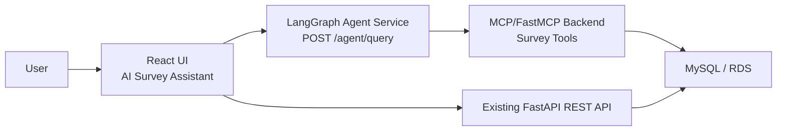
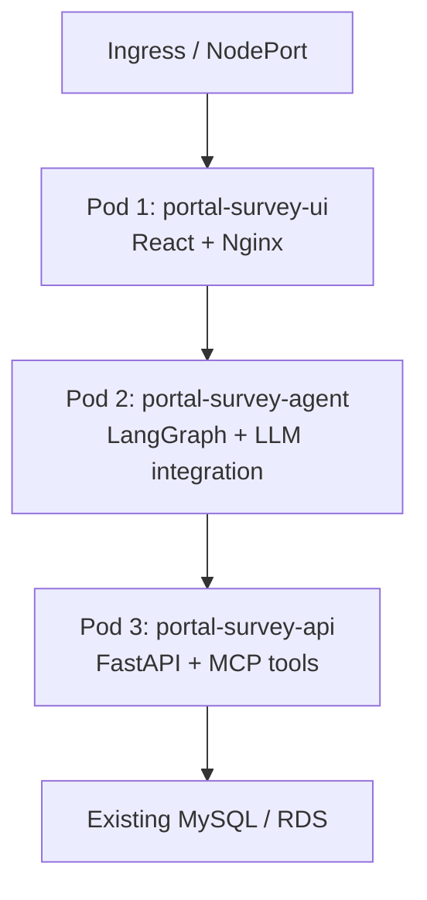

# Design Document

## Architecture

Kubernetes deployment:

## Graph Design

The LangGraph workflow is implemented in `portal-survey-agent/graph.py`.

Required nodes:

- `input`: accepts the user request and session state.
- `intent_understanding`: classifies the request as create, read, update, delete, cancel, or unknown. If `OPENAI_API_KEY` is set, an OpenAI chat model is used for classification; otherwise the deterministic classifier is used.
- `create_branch`, `read_branch`, `update_branch`, `delete_branch`: route CRUD-specific logic.
- `mcp_tool_execution`: invokes the selected MCP tool. The client attempts FastMCP first and falls back to REST calls for local resilience.
- `result_response`: formats a user-facing answer.

Conditional routing:

- create request -> draft extraction -> missing-field follow-up -> summary -> confirmation -> `create_survey`
- read request -> list/search filters -> `list_surveys` or `search_surveys`
- update request -> target lookup -> change extraction -> confirmation -> `update_survey`
- delete request -> target lookup -> details shown -> confirmation -> `delete_survey`

## State Management

The agent keeps simple per-session state in memory. The state includes:

- active survey draft for create workflows
- selected survey for update/delete workflows
- proposed update changes
- pending action requiring confirmation
- confirmation status

This satisfies the assignment requirement for simple per-session workflow state without adding a persistent memory system.

## MCP Tools

The MCP tool layer is implemented in `portal-survey-api/mcp_tools.py`.

Tools:

- `create_survey(payload)`
- `list_surveys()`
- `get_survey_by_id(survey_id)`
- `search_surveys(first_name, last_name, liked_most, interest_source, recommendation, submitted_from, submitted_to)`
- `update_survey(survey_id, changes)`
- `delete_survey(survey_id)`

Each tool returns structured JSON with an `ok` flag and either survey data, search results, or an error message.

## Human-In-The-Loop Safety

Create, update, and delete are write operations. The agent does not call write/delete tools immediately.

- Create: asks for all missing required fields, shows a final summary, then waits for confirmation.
- Update: finds the survey, shows the current record and proposed changes, then waits for confirmation.
- Delete: finds the survey, shows the record, then waits for confirmation.

## Challenges Faced

- Maintaining compatibility with the original CRUD app while adding an MCP layer. This was solved by moving shared persistence logic into `services/survey_service.py`.
- Making the demo reliable even if an LLM API key is unavailable. The agent supports OpenAI classification when configured and deterministic fallback routing when not configured.
- Browser routing in Kubernetes. Nginx now proxies `/api` and `/agent-api`, while Helm ingress also exposes both paths.

